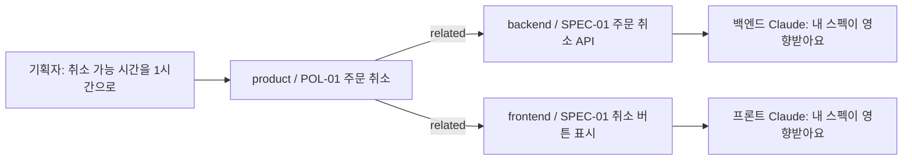

# 동작

## 사람이 부탁하지 않아도 도는 장치 넷

`core` 플러그인의 훅입니다.

| 언제 | 훅 | 하는 일 |
|---|---|---|
| 세션을 열 때 | session_start | 공통 규칙을 넣고, 내 저장소와 읽는 저장소를 당기고, 지난번 이후 바뀐 문서·새 결정·영향받는 내 문서를 알린다 |
| 말을 걸 때마다 | prompt_check | 저장소들이 바뀌었는지 확인해, 방금 들어온 변경을 그 대화의 다음 말에 알린다 |
| 문서를 저장할 때 | after_doc_edit | 형식·번호·상태·참조를 검사하고 목차를 다시 만든다 |
| 커밋할 때 | check_commit_msg | 커밋 메시지에 이슈 키가 없으면 막는다 |

## 변경이 퍼지는 모습

스펙은 머리 정보의 `related`에 자기가 기대는 정책서를 적어 둡니다. 정책서가 바뀌면, 그 정책서를 가리키는 스펙을 가진 저장소의 Claude가 다음 말에 그 사실을 꺼냅니다.

## 공통 규칙

`plugins/core/RULES.md`가 세션 시작에 모든 저장소의 Claude에게 들어갑니다. 요지는 이렇습니다.

- 알림 줄(`[변경]`·`[영향]`·`[지금]`)은 Claude가 읽는 것이고, 사람에게는 사람 말로 전한다.
- 사람은 스킬 이름을 몰라도 된다. 어디에 남길지, 양식과 번호는 Claude가 정해 한 줄로 알린다.
- git은 Claude가 한다. 머지는 사람이 이 대화에서 "승인"이라고 말한 뒤에만.
- 토큰은 대화로 받지 않는다. 사람이 `tokens.txt`에 넣고, Claude는 그 파일을 열지 않는다.
- 파일 수정은 편집 도구로, 옆 저장소는 경로로 읽는다. 그래야 사람에게 "허용할까요?"가 뜨지 않는다.
