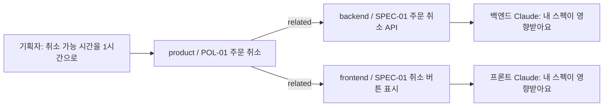

# 동작

## 사람이 부탁하지 않아도 도는 장치 넷

`core` 플러그인의 훅입니다.

| 언제 | 훅 | 하는 일 |
|---|---|---|
| 세션을 열 때 | session_start | 공통 규칙을 넣고, 내 저장소와 읽는 저장소를 당기고, 지난번 이후 바뀐 문서·새 결정·영향받는 내 문서를 알린다 |
| 말을 걸 때마다 | prompt_check | 저장소들이 바뀌었는지 확인해, 방금 들어온 변경을 그 대화의 다음 말에 알린다 |
| 문서를 저장할 때 | after_doc_edit | 형식·번호·상태·참조를 검사하고 목차를 다시 만든다 |
| 커밋할 때 | check_commit_msg | 커밋 메시지에 이슈 키가 없으면 막는다 |

## 변경이 퍼지는 모습

스펙은 머리 정보의 `related`에 자기가 기대는 정책서를 적어 둡니다. 정책서가 바뀌면, 그 정책서를 가리키는 스펙을 가진 저장소의 Claude가 다음 말에 그 사실을 꺼냅니다.

## 철학을 장치로

PHILOSOPHY.md의 방침이 실제로 어떻게 도는지입니다. 시연 환경에서 네 가지 모두 확인했습니다.

| 장면 | 장치 | 사람이 보는 것 |
|---|---|---|
| **결정의 크기** — 정책서를 고칠 때 | `downstream.py`가 이 문서에 기대는 다른 저장소 문서를 센다. 뜻이 바뀌고 기대는 문서가 있으면 큰 결정 | 큰 결정: 고치되 '검토 중'으로, 결정 기록에 "회의 확정 필요" 한 줄, "한 사람 더 보실 분이 있나요?"(기본은 저장소 주인). 작은 결정: 바로 고치고 바뀐 내역에만 |
| **대신 답하기** — 들어온 질문이 문서로 답해질 때 | 답변 스킬이 근거(문서와 대목)를 붙여 바로 답하고 `answered.py`로 `notes/대신-답한-기록.md`에 한 줄. 근거가 없으면 대신 답하지 않는다 | 다음에 세션을 열면 "제가 대신 답한 것이 1건 있어요 — 근거는 … 아니면 말씀해 주세요". "아니야"라고 하면 바로잡고, 그 답에 기대는 쪽에 바뀐 답이 간다 |
| **낡음 신호** — 기대던 문서가 나중에 바뀌었을 때 | 목차를 만들 때 계산한다: 기대던 문서가 나보다 나중에 바뀜 · 답 없는 질문 7일 넘김 · 다시 볼 날 지남. 목차 맨 위 "살펴볼 것"과 세션 시작 `[낡음]` | "내 스펙 하나가 낡았어요 — 기대던 정책서가 바뀐 뒤 고쳐지지 않았어요". 상태를 사람이 붙이지 않는다 |
| **돌아오는 길** — 구현하다 정책의 빈틈을 만났을 때 | 개발 스킬이 가른다: 사용자에게 보이는 결과·돈·권한이 달라지면 정책의 빈틈 → 기획 쪽 질문. 보이지 않는 구현 세부면 스펙에서 정한다 | "정책의 빈틈이라 기획 쪽에 질문으로 올렸습니다. 답이 오기 전까지 스펙은 정책서대로 둡니다" |

한계: 기대는 문서를 세려면 그 저장소가 내 컴퓨터에 받아져 있어야 합니다. 기획자 컴퓨터에는 백엔드·프론트가 없으므로 "세지 못함"이라고 말하고, 이때 뜻이 바뀌는 정책 변경은 큰 결정으로 다룹니다.

## 공통 규칙

`plugins/core/RULES.md`가 세션 시작에 모든 저장소의 Claude에게 들어갑니다. 요지는 이렇습니다.

- 알림 줄(`[변경]`·`[영향]`·`[지금]`·`[낡음]`·`[대신 답함]`)은 Claude가 읽는 것이고, 사람에게는 사람 말로 전한다.
- 사람은 스킬 이름을 몰라도 된다. 어디에 남길지, 양식과 번호는 Claude가 정해 한 줄로 알린다.
- git은 Claude가 한다. 머지는 사람이 이 대화에서 "승인"이라고 말한 뒤에만.
- 토큰은 대화로 받지 않는다. 사람이 `tokens.txt`에 넣고, Claude는 그 파일을 열지 않는다.
- 파일 수정은 편집 도구로, 옆 저장소는 경로로 읽는다. 그래야 사람에게 "허용할까요?"가 뜨지 않는다.
